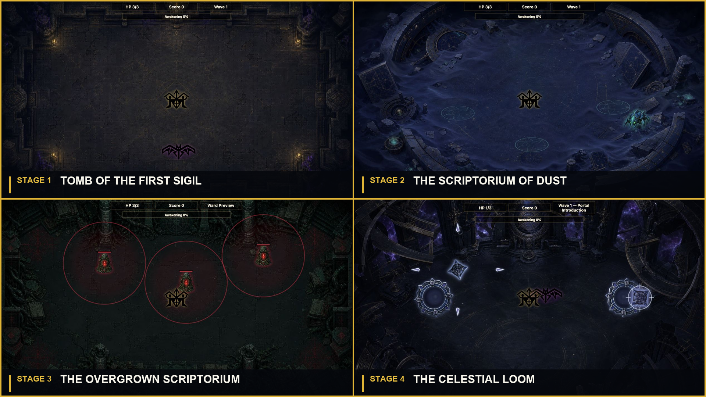

# Living Sigil

**A four-stage twin-stick action game about awakening an ancient symbol and reclaiming the lost sigils of the Cosmic Ascent.**

### [Play Living Sigil in your browser](https://vibezzzcoder.github.io/living-sigil/)

## About the game

You are the Living Sigil: a dormant mark awakened inside a forgotten tomb. Fight through four ancient arenas, survive their guardians, and reclaim the First, Dust, Verdant, and Astral Sigils.

Each stage introduces a new battlefield rule. Quicksand slows your escape, crimson wards protect enemies, and linked portals fold the arena around you. Defeat the Astral Weaver and unite all four sigils to complete the first Cosmic Ascent.

Living Sigil plays directly in a desktop or mobile browser. No installation is required.

## How to play

Move and shoot independently, survive each stage's waves, defeat its guardian, and touch the fallen sigil to reclaim it. Collecting a sigil restores your health before the next stage.

Defeated enemies fill the **Awakening** meter. When it reaches 100%, activate Awakening to briefly move faster and fire a powerful three-shot spread.

| Action | Keyboard | Touch |
| --- | --- | --- |
| Move | `W` `A` `S` `D` | Left joystick |
| Shoot | Arrow keys | Right joystick |
| Awaken | `Space` | Awaken button |
| Pause / resume | `P`, `Enter`, or `Escape` | Pause button |
| Restart the run | `R` | Restart button on end screens |

## The four stages

### Stage 1 — Tomb of the First Sigil

Learn the core rhythm against swarms of Shadow Wings: keep moving, fire in a different direction, and build Awakening energy. The **Gold Wing Warden** waits at the end of the tomb and guards the First Sigil.

### Stage 2 — The Scriptorium of Dust

Glowing quicksand circles cut your movement speed in half, while **Sand Dashers** telegraph sudden charges across the buried archive. Stay out of the slow zones when a dash is coming, then defeat the **Guardian of the Scriptorium** to reclaim the Dust Sigil.

### Stage 3 — The Overgrown Scriptorium

Crimson **Warded Glyph Anchors** protect nearby enemies. You can still damage a protected enemy, but destroying its anchor first is far more effective. Break the wards, clear the Vine Glyphs, and overcome the **Bramble Heart** to purify the Verdant Sigil.

### Stage 4 — The Celestial Loom

Two linked Astrolabe Portals teleport both you and the stage's Star Cores across the arena. Learn where each portal exits, watch for the Star Cores' cardinal shard bursts, and use the portals to escape the **Astral Weaver's** sweeping attacks. Reclaiming the Astral Sigil completes the four-stage arc.

## Quick tips

- Keep moving. Contact with an enemy costs health even if no projectile hits you.
- Watch for telegraphs before Sand Dasher charges and boss attacks.
- In Stage 3, red ward circles are a target-priority clue: destroy the anchor before focusing on the enemies inside.
- Save Awakening for crowded waves or a boss opening when you can use the full burst.
- After defeating a guardian, move onto the dropped sigil to continue.

## License

The software source code is licensed under the [MIT License](CODE_LICENSE.md).

The original artwork, symbols, sprites, character and enemy designs, visual identity, reference images, generated art, processed art, and embedded image assets are copyright © 2005–2026 E RM and are covered by the [Living Sigil Asset License](ASSET_LICENSE.md). They may be viewed, shared, and used with this game for non-commercial purposes; commercial use requires prior written permission.
